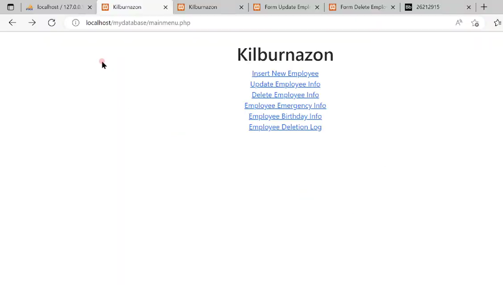

# 📘 Database Design Project – COMP23111

**Name:** Khairunnisa Khan Binti Talib  
**Module Code:** COMP23111 – Database System  
**Title:** Database Design  
**Date Submitted:** 09/11/2022

---

## 📂 Contents

This repository contains a full database design project completed for the COMP23111 module. The project includes:

- 📌 **Entity-Relationship Diagrams (ERD)** – in UNF and 3NF
- 📌 **Normalization Report** – UNF → 1NF → 2NF → 3NF
- 📌 **Relational Schema** – all tables with PK/FK definitions and constraints
- 📌 **Analysis Reports** – explanation of design decisions and normalization choices

---

## 📊 ERD

- Shows entity relationships before and after normalization
- Uses bridging entities to resolve many-to-many relationships
- Highlights weak entities and composite keys

---

## 🧪 Normalization

- Analyzes initial UNF relations
- Demonstrates conversion to 1NF, 2NF, and 3NF
- Identifies and removes partial and transitive dependencies
- Supports design with detailed justifications and new entity introductions

---

## 🗃️ Relational Schema

- Fully normalized schema in 3NF
- Includes:
  - Primary and foreign keys
  - Data types (e.g., `INT`, `VARCHAR`, `DATE`)
  - ON DELETE / ON UPDATE actions
- Discusses decisions such as use of cascading updates or deletions

---

## 🎥 Video Presentation

If you to want to watch the video walk-through you can:
****

---

## 🧑‍💻 Author

**Khairunnisa Khan Binti Talib**  
Bachelor of Science in Computer Science  
University of Manchester  
